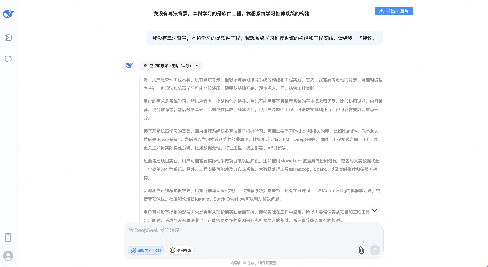
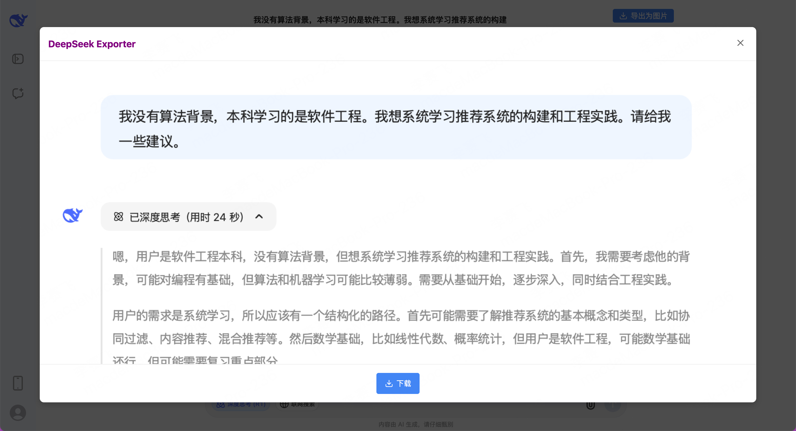

# DeepSeek Exporter

A Chrome extension that allows you to export conversations from the DeepSeek web interface as images.

## Features

- Export your DeepSeek conversations as high-quality PNG images
- Simple one-click export button added to the DeepSeek interface
- Preview images before downloading
- Works with the web version of DeepSeek at chat.deepseek.com

## Usage screenshot

## Installation

### From Source (Developer Mode)

1. Clone this repository or download it as a ZIP file
2. Open Chrome and navigate to `chrome://extensions/`
3. Enable "Developer mode" by toggling the switch in the top-right corner
4. Click "Load unpacked" and select the directory containing the extension files
5. The extension should now be installed and active

### From Chrome Web Store

(Coming soon)

## Usage

1. Navigate to [DeepSeek Chat](https://chat.deepseek.com/)
2. You'll see an "Export as Image" button in the header
3. Click the button to capture the current conversation
4. Preview the image and click "Download" to save it to your computer

## Troubleshooting

### Other Issues

If you encounter any other issues:

1. Check the browser console for error messages (press F12 to open developer tools)
2. Make sure you're using the latest version of Chrome
3. Try disabling other extensions that might interfere with this one

## Development

This extension uses:
- HTML, CSS, and JavaScript
- html2canvas library for capturing the conversation as an image

### Building from Source

1. Clone the repository
2. Make sure you have Node.js installed
3. Run `npm install` to install development dependencies
4. Run `npm run convert-icons` to convert SVG icons to PNG format
5. Load the extension in Chrome as described in the Installation section

## License

MIT

## Credits

Created by Walter Mitty with Cursor.
